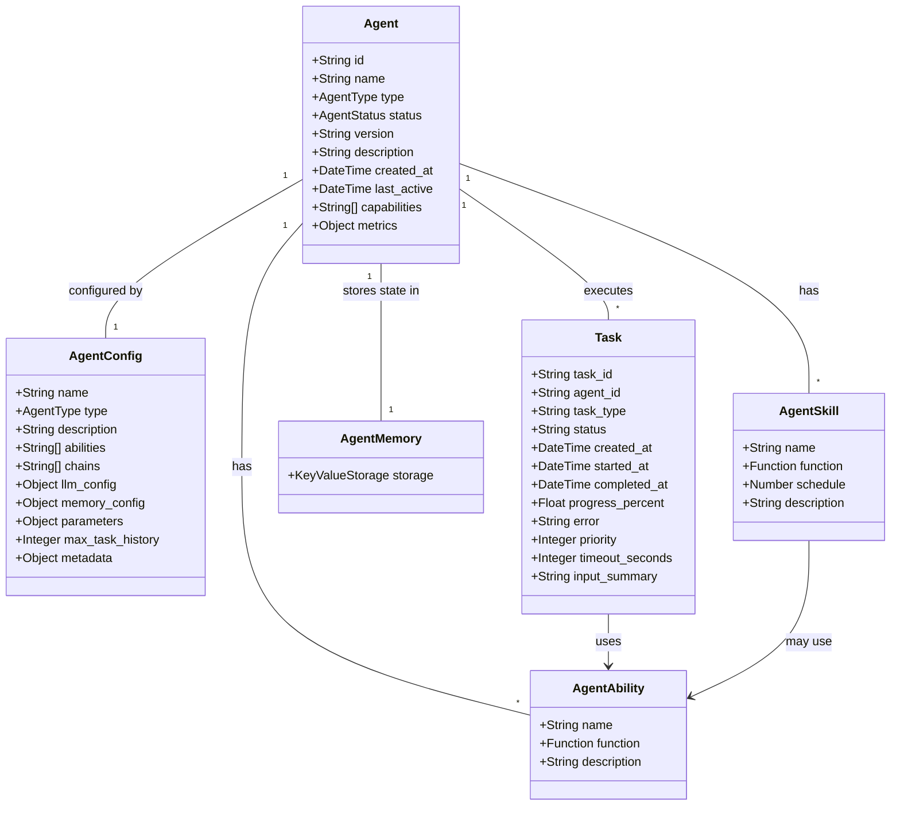
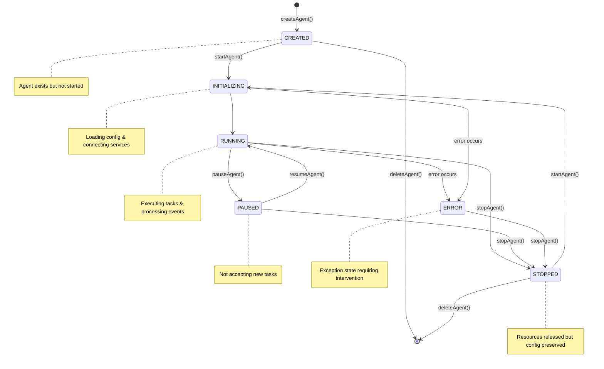
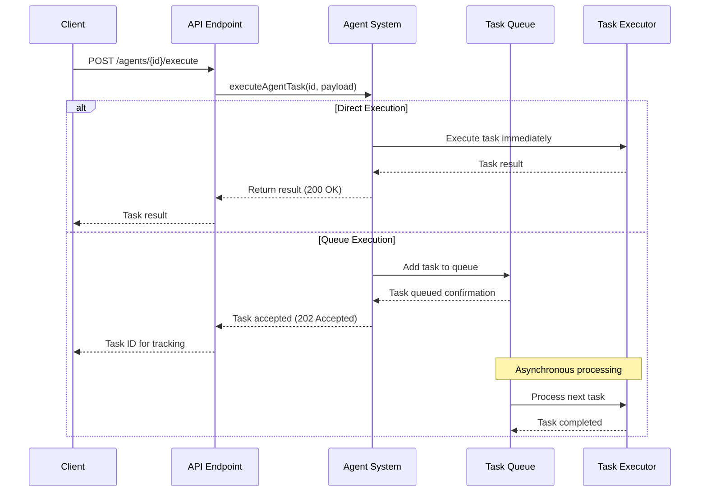

# Agent API Detailed Design Document

## Table of Contents

1. [Introduction](#introduction)  
2. [System Overview](#system-overview)  
3. [Object Design](#object-design)  
4. [API Architecture](#api-architecture)  
5. [API Endpoints](#api-endpoints)  
   - [Agent Management](#agent-management)  
   - [Agent Lifecycle](#agent-lifecycle)  
   - [Task Execution](#task-execution)  
   - [Agent Monitoring](#agent-monitoring)  
   - [Memory Management](#memory-management)  
   - [Swarm Communication](#swarm-communication)  
   - [Abilities & Skills Management](#abilities--skills-management)  
   - [Bulk Operations](#bulk-operations)  
6. [Schema Definitions](#schema-definitions)  
   - [Agent Related Schemas](#agent-related-schemas)  
   - [Task Related Schemas](#task-related-schemas)  
   - [Memory Related Schemas](#memory-related-schemas)  
   - [Monitoring Related Schemas](#monitoring-related-schemas)  
   - [Swarm Related Schemas](#swarm-related-schemas)  
   - [Abilities & Skills Related Schemas](#abilities--skills-related-schemas)  
   - [Error Related Schemas](#error-related-schemas)  
7. [Best Practices](#best-practices)

## Introduction

This document describes the design and implementation of the Agent System, a flexible framework for creating, managing, and deploying autonomous agents for various tasks. The system provides a comprehensive REST API for agent lifecycle management, configuration, monitoring, and inter-agent communication, with implementation built on Julia programming language.

The Agent System is designed to support the creation and management of different types of autonomous agents that can perform various tasks such as trading, monitoring, data collection, and notifications. The system allows users to create agents with specific capabilities, configure their behavior, and monitor their performance.

### Key Features

The Agent System includes the following key features:

- Agent lifecycle management (create, start, pause, resume, stop, delete)
- Agent configuration and customization
- Agent monitoring and health checks
- Inter-agent communication via a swarm mechanism
- Agent memory management
- Extensible agent abilities and skills
- Task execution through abilities and skills
- LLM integration for AI-powered capabilities

## System Overview

The Agent System is designed to support the creation and management of different types of autonomous agents that can perform various tasks. The architecture is structured around several key concepts:

1. **Agents**: Core entities that represent autonomous components capable of performing tasks.
2. **Abilities**: Functional capabilities that agents can perform.
3. **Skills**: Specialized functions that can be scheduled for automatic execution.
4. **Tasks**: Units of work that agents execute.
5. **Memory**: Key-value store for persisting agent state.
6. **Swarm**: Communication mechanism between agents.

The system is built with flexibility, scalability, and extensibility in mind. It can be integrated with various backend services and supports multiple communication protocols for inter-agent communication.

## Object Design

### Core Objects

The Agent System is built around several core object types:

#### Agent

The central entity representing an autonomous component capable of performing tasks.

**Properties:**
- `id`: Unique identifier
- `name`: Human-readable name
- `type`: Type of agent (TRADING, MONITOR, ARBITRAGE, DATA_COLLECTION, NOTIFICATION, CUSTOM)
- `status`: Current status (CREATED, INITIALIZING, RUNNING, PAUSED, STOPPED, ERROR)
- `version`: Agent version
- `description`: Descriptive text
- `created_at`: Creation timestamp
- `last_active`: Last activity timestamp
- `capabilities`: List of agent capabilities
- `metrics`: Performance metrics

#### AgentConfig

Configuration parameters for creating or updating an agent.

**Properties:**
- `name`: Agent name
- `type`: Agent type
- `description`: Description of the agent's function
- `abilities`: List of enabled abilities
- `chains`: Supported blockchain networks
- `llm_config`: LLM configuration (for AI-powered agents)
- `memory_config`: Memory configuration
- `parameters`: Custom parameters for agent behavior
- `max_task_history`: Maximum number of tasks to keep in history
- `metadata`: User-defined metadata

#### Task

A unit of work that an agent can execute.

**Properties:**
- `task_id`: Unique identifier
- `agent_id`: The agent executing the task
- `task_type`: Type of task
- `status`: Task status (PENDING, RUNNING, COMPLETED, FAILED, CANCELLED)
- `created_at`: Creation timestamp
- `started_at`: Start timestamp
- `completed_at`: Completion timestamp
- `progress_percent`: Completion percentage
- `error`: Error message (if failed)
- `priority`: Task priority level
- `timeout_seconds`: Task timeout
- `input_summary`: Summary of task input

### Additional Components

#### AgentAbility

A functional capability that agents can perform.

**Properties:**
- `name`: Ability name
- `function`: Function code that implements the ability
- `description`: Description of what the ability does

#### AgentSkill

A specialized function that can be scheduled for automatic execution.

**Properties:**
- `name`: Skill name
- `function`: Function code that implements the skill
- `schedule`: Execution frequency in seconds (0 for on-demand only)
- `description`: Description of what the skill does

#### AgentMemory

Key-value store for persisting agent state.

### UML Class Diagram



## API Architecture

The Agent System API follows REST principles and is organized around resource-oriented URLs. The API uses standard HTTP methods to perform actions on resources:

- **GET**: Retrieve resources
- **POST**: Create new resources or trigger actions
- **PUT**: Update existing resources
- **DELETE**: Remove resources

All API responses are in JSON format, with appropriate HTTP status codes to indicate success or failure. Authentication and authorization mechanisms are implemented to ensure secure access to the API.

### Key Resources

| API Path | HTTP Method | Description | Implementation in AgentHandlers.jl |
|----------|-------------|-------------|-----------------------------------|
| `/agents` | `GET` | List all agents | ✅ `list_agents_handler` |
| `/agents` | `POST` | Create a new agent | ✅ `create_agent_handler` |
| `/agents/{agent_id}` | `GET` | Get agent status | ✅ `get_agent_status_handler` |
| `/agents/{agent_id}` | `PUT` | Update agent configuration | ✅ `update_agent_handler` |
| `/agents/{agent_id}` | `DELETE` | Delete an agent | ✅ `delete_agent_handler` |
| `/agents/{agent_id}/start` | `POST` | Start agent lifecycle | ✅ `start_agent_handler` |
| `/agents/{agent_id}/stop` | `POST` | Stop agent | ✅ `stop_agent_handler` |
| `/agents/{agent_id}/pause` | `POST` | Pause agent | ✅ `pause_agent_handler` |
| `/agents/{agent_id}/resume` | `POST` | Resume agent | ✅ `resume_agent_handler` |
| `/agents/{agent_id}/execute` | `POST` | Execute agent task | ✅ `execute_agent_task_handler` |
| `/agents/{agent_id}/memory` | `GET` | Get agent memory | ✅ `get_agent_memory_handler` |
| `/agents/{agent_id}/memory` | `PUT` | Update agent memory | ✅ `set_agent_memory_handler` |
| `/agents/{agent_id}/memory` | `DELETE` | Clear agent memory | ✅ `clear_agent_memory_handler` |
| `/agents/{agent_id}/metrics` | `GET` | Get agent performance metrics | ❓ Not explicitly found |
| `/agents/{agent_id}/health` | `GET` | Get agent health status | ❓ Not explicitly found |
| `/agents/monitor/start` | `POST` | Start system monitoring | ❓ Not explicitly found |
| `/agents/monitor/stop` | `POST` | Stop system monitoring | ❓ Not explicitly found |
| `/agents/{agent_id}/swarm/publish` | `POST` | Publish message to swarm | ❓ Not explicitly found |
| `/agents/{agent_id}/swarm/subscribe` | `POST` | Subscribe to swarm topic | ❓ Not explicitly found |
| `/agents/{agent_id}/swarm/unsubscribe` | `POST` | Unsubscribe from swarm topic | ❓ Not explicitly found |
| `/agents/{agent_id}/swarm/connect` | `POST` | Connect to swarm | ❓ Not explicitly found |
| `/agents/{agent_id}/swarm/disconnect` | `POST` | Disconnect from swarm | ❓ Not explicitly found |
| `/agents/{agent_id}/abilities` | `POST` | Register agent abilities | ❓ Not explicitly found |
| `/agents/{agent_id}/skills` | `POST` | Register agent skills | ❓ Not explicitly found |
| `/agents/{agent_id}/clone` | `POST` | Clone an agent | ✅ `clone_agent_handler` |
| `/agents/bulk-delete` | `POST` | Batch delete agents | ✅ `bulk_delete_agents_handler` |

*Note: Additional implemented endpoints in AgentHandlers.jl not mentioned in API spec:*
- `/agents/{agent_id}/tasks` - `GET` - `list_agent_tasks_handler`
- `/agents/{agent_id}/tasks/{task_id}` - `GET` - `get_task_status_handler`
- `/agents/{agent_id}/tasks/{task_id}/result` - `GET` - `get_task_result_handler`
- `/agents/{agent_id}/tasks/{task_id}/cancel` - `POST` - `cancel_task_handler`
- `/agents/{agent_id}/evaluate_fitness` - `POST` - `evaluate_agent_fitness_handler`

## API Endpoints

This section details the various API endpoints provided by the Agent System and their functionalities.

### Agent Management

#### List Agents (GET /agents)

This endpoint lists all agents registered in the system, supporting various filtering conditions and pagination.

**Request Parameters:**
- `type` (query parameter): Filter by agent type (TRADING, MONITOR, etc.)
- `status` (query parameter): Filter by agent status (CREATED, RUNNING, etc.)
- `name` (query parameter): Filter by agent name keyword (fuzzy matching)
- `order_by` (query parameter): Sort field (created_at, name, type, status)
- `order_direction` (query parameter): Sort direction (asc, desc)
- `limit` (query parameter): Page size (default 20)
- `offset` (query parameter): Pagination start position (default 0)

**Functionality:**
- Supports filtering by type, status, and name
- Supports sorting by multiple fields
- Supports pagination for handling large data sets
- Returns list of basic agent information

**Response:**
- On success, returns agent list and pagination information
- `200 OK`: Operation successful
- `400 Bad Request`: Request parameter error

#### Create Agent (POST /agents)

This endpoint creates a new agent and initializes its configuration, with the agent starting in CREATED state.

**Request Body:**
- `name` (required): Agent name
- `type` (required): Agent type
- `description`: Agent description
- `abilities`: List of abilities
- `chains`: Supported blockchain networks
- `llm_config`: LLM configuration
- `memory_config`: Memory configuration
- `parameters`: Custom parameters
- `max_task_history`: Maximum number of task history records

**Functionality:**
- Initializes a new agent instance
- Sets basic configuration and abilities
- Assigns a unique identifier
- Prepares the agent execution environment

**Response:**
- `201 Created`: Agent created successfully
- `400 Bad Request`: Request data validation failed
- `409 Conflict`: Name conflict

#### Get Agent Status (GET /agents/{agent_id})

This endpoint retrieves detailed status information for a specific agent.

**Path Parameters:**
- `agent_id`: Unique identifier of the agent

**Functionality:**
- Returns basic agent information (ID, name, type, etc.)
- Provides current running status information
- Displays recent task execution status
- Includes performance metrics information
- Shows configuration information
- Displays last activity time
- Provides error information if any

**Response:**
- `200 OK`: Successfully returned agent status
- `404 Not Found`: Agent not found

#### Update Agent (PUT /agents/{agent_id})

This endpoint updates the configuration of an existing agent.

**Path Parameters:**
- `agent_id`: Unique identifier of the agent

**Request Body:**
- `name`: New agent name
- `description`: New function description
- `abilities`: Updated list of abilities
- `model_config`: Updated model configuration
- `parameters`: Updated parameter configuration
- `metadata`: Updated metadata

**Functionality:**
- Supports modifying agent name and description
- Allows updating agent abilities list
- Supports adjusting model configuration
- Can modify custom parameters
- Allows updating metadata
- Some core configurations (such as agent type) cannot be changed after creation

**Response:**
- `200 OK`: Agent updated successfully
- `400 Bad Request`: Request data validation failed
- `404 Not Found`: Agent not found

#### Delete Agent (DELETE /agents/{agent_id})

This endpoint deletes the specified agent.

**Path Parameters:**
- `agent_id`: Unique identifier of the agent

**Functionality:**
- Stops all executing tasks
- Clears the agent's memory state
- Removes the agent's configuration information
- Disconnects from the swarm
- Delete operation is irreversible, please use with caution

**Response:**
- `200 OK`: Agent deleted successfully
- `404 Not Found`: Agent not found
- `409 Conflict`: Conflict, unable to delete (e.g., agent is executing important tasks)

### Agent Lifecycle

#### Starting an Agent (POST /agents/{agent_id}/start)

This endpoint is used to start a specified agent.

**Path Parameters:**
- `agent_id`: Unique identifier of the agent

**Description:**
- Initializes the running environment of the agent
- Loads configuration and abilities
- Restores memory state (if any)
- Connects to necessary external services
- Starts executing predefined tasks

**Response:**
- `200 OK`: Agent started successfully
- `404 Not Found`: Agent not found
- `409 Conflict`: Status conflict (e.g., agent is already running)

#### Stopping an Agent (POST /agents/{agent_id}/stop)

This endpoint is used to stop a specified agent.

**Path Parameters:**
- `agent_id`: Unique identifier of the agent

**Description:**
- Safely terminates the currently executing task
- Saves current state
- Disconnects from external services
- Releases resources
- Stopping operation preserves the configuration and state of the agent, allowing it to be restarted at any time

**Response:**
- `200 OK`: Agent stopped successfully
- `404 Not Found`: Agent not found
- `409 Conflict`: Status conflict (e.g., agent is already stopped)

#### Pausing an Agent (POST /agents/{agent_id}/pause)

This endpoint is used to pause the execution of an agent.

**Path Parameters:**
- `agent_id`: Unique identifier of the agent

**Description:**
- Stops accepting new tasks
- Maintains existing connections
- Preserves memory state
- Can be quickly resumed
- Pausing operation is suitable for temporary interruptions in agent activity

**Response:**
- `200 OK`: Agent paused successfully
- `404 Not Found`: Agent not found
- `409 Conflict`: Status conflict (e.g., agent is not running)

#### Resuming an Agent (POST /agents/{agent_id}/resume)

This endpoint is used to resume a paused agent.

**Path Parameters:**
- `agent_id`: Unique identifier of the agent

**Description:**
- Starts accepting tasks again
- Checks and restores previous working state
- Continues executing periodic tasks
- Reactivates all abilities

**Response:**
- `200 OK`: Agent resumed successfully
- `404 Not Found`: Agent not found
- `409 Conflict`: Status conflict (e.g., agent is not in pause state)

### Task Execution

#### Executing Agent Task (POST /agents/{agent_id}/execute)

This endpoint is used to allow an agent to execute a specified task.

**Path Parameters:**
- `agent_id`: Unique identifier of the agent

**Request Body:**
- `ability` (required): Name of the ability to execute
- `mode`: Execution mode (direct direct execution or queue queue mode)
- `priority`: Task priority (only used in queue mode)
- Additional custom parameters can be added

**Description:**
- Supports synchronous execution: waiting for the task to complete and returning the result
- Supports asynchronous execution: immediately returns the task ID, result via other API
- Supports scheduled execution: setting tasks to execute at specific times
- Supports conditional execution: setting trigger conditions
- Records detailed logs and performance metrics

**Response:**
- `200 OK`: Task submission successful, returns execution result
- `202 Accepted`: Task accepted and queued, but not yet completed
- `400 Bad Request`: Failed data validation
- `404 Not Found`: Agent not found
- `409 Conflict`: Agent unable to execute task (e.g., incorrect state)

### Memory Management

#### Getting Agent Memory (GET /agents/{agent_id}/memory)

This endpoint is used to get the memory state of an agent.

**Path Parameters:**
- `agent_id`: Unique identifier of the agent

**Description:**
- Retrieves historical interaction records
- Retrieves learned knowledge
- Retrieves contextual information
- Retrieves temporary data
- Retrieves cached calculation results
- Can be used for analyzing agent behavior and debugging issues

**Response:**
- `200 OK`: Successfully returns the memory state of the agent
- `404 Not Found`: Agent not found

#### Updating Agent Memory (PUT /agents/{agent_id}/memory)

This endpoint is used to update the memory state of an agent.

**Path Parameters:**
- `agent_id`: Unique identifier of the agent

**Request Body:**
- `key` (required): Memory key
- `value` (required): Memory value

**Description:**
- Adds a new memory item
- Modifies existing memory
- Sets expiration time for memory
- Adjusts memory priority
- Note: Modifying memory may affect agent behavior, please proceed with caution

**Response:**
- `200 OK`: Memory updated successfully
- `400 Bad Request`: Failed data validation
- `404 Not Found`: Agent not found

#### Clearing Agent Memory (DELETE /agents/{agent_id}/memory)

This endpoint is used to clear the memory state of an agent.

**Path Parameters:**
- `agent_id`: Unique identifier of the agent

**Description:**
- Deletes all historical records
- Resets learning state
- Clears contextual information
- Deletes cached data
- Suitable for resetting the agent to its initial state

**Response:**
- `200 OK`: Memory cleared successfully
- `404 Not Found`: Agent not found

### Agent Monitoring

#### Getting Agent Metrics (GET /agents/{agent_id}/metrics)

This endpoint is used to get performance metrics data of an agent.

**Path Parameters:**
- `agent_id`: Unique identifier of the agent

**Query Parameters:**
- `timeframe`: Time range for metrics (e.g., 1h, 24h, 7d, etc.)

**Description:**
- Statistics of task execution (success rate, average duration, etc.)
- Resource usage (CPU, memory, network, etc.)
- Counter for operations (number of API calls, number of event processing, etc.)
- Error statistics
- Custom metrics
- Supports specifying time range and aggregation method

**Response:**
- `200 OK`: Successfully returns agent metrics
- `404 Not Found`: Agent not found

#### Getting Agent Health Status (GET /agents/{agent_id}/health)

This endpoint is used to get health status check results of an agent.

**Path Parameters:**
- `agent_id`: Unique identifier of the agent

**Description:**
- Core service status
- Necessary connection availability
- Level of resource usage
- Error rate monitoring
- Performance threshold checks
- Data consistency verification
- Used for monitoring the running state of the agent and detecting issues in a timely manner

**Response:**
- `200 OK`: Successfully returns agent health status
- `404 Not Found`: Agent not found

#### Starting Agent Monitoring System (POST /agents/monitor/start)

This endpoint is used to start system-wide agent monitoring.

**Description:**
- Collects performance metrics of all agents
- Monitors health status of agents
- Generates system-level statistics
- Triggers alerts (when anomalies are detected)
- Provides storage and querying of monitoring data
- Monitoring system has a slight impact on system performance

**Response:**
- `200 OK`: Monitoring system started successfully
- `409 Conflict`: Monitoring system is already running

#### Stopping Agent Monitoring System (POST /agents/monitor/stop)

This endpoint is used to stop system-wide agent monitoring.

**Description:**
- Terminates all monitoring tasks
- Saves current monitoring data
- Cleans up temporary resources
- Stops alert service
- Can be restarted at any time without losing historical data

**Response:**
- `200 OK`: Monitoring system stopped successfully
- `409 Conflict`: Monitoring system is not running

### Swarm Communication

#### Publishing Message to Swarm (POST /agents/{agent_id}/swarm/publish)

This endpoint is used to publish a message to Swarm.

**Path Parameters:**
- `agent_id`: Unique identifier of the agent

**Request Body:**
- `topic` (required): Topic
- `message` (required): Message content

**Description:**
- Publishes to a specific topic
- Broadcasts to all subscribers
- Sets message priority
- Message persistence
- Message confirmation mechanism
- Swarm communication is used for agent collaboration and information sharing

**Response:**
- `200 OK`: Message published successfully
- `400 Bad Request`: Failed data validation
- `404 Not Found`: Agent not found
- `409 Conflict`: Agent not connected to Swarm

#### Subscribing to Swarm Topic (POST /agents/{agent_id}/swarm/subscribe)

This endpoint is used to subscribe to Swarm message topics.

**Path Parameters:**
- `agent_id`: Unique identifier of the agent

**Request Body:**
- `topic` (required): Topic

**Description:**
- Subscribes to a specific topic
- Uses wildcards to subscribe to multiple topics
- Sets message filter
- Configures subscription options (QoS, etc.)
- Sets message processing callback
- After subscribing, the agent will receive all messages related to the topic

**Response:**
- `200 OK`: Subscription successful
- `400 Bad Request`: Failed data validation
- `404 Not Found`: Agent not found or topic not subscribed
- `409 Conflict`: Agent not connected to Swarm

#### Unsubscribing from Swarm Topic (POST /agents/{agent_id}/swarm/unsubscribe)

This endpoint is used to unsubscribe from Swarm message topics.

**Path Parameters:**
- `agent_id`: Unique identifier of the agent

**Request Body:**
- `topic` (required): Topic

**Description:**
- Stops receiving messages from a specific topic
- Cleans up related subscription state
- Removes message processing callback
- Releases related resources
- Does not affect other topic subscriptions

**Response:**
- `200 OK`: Unsubscription successful
- `400 Bad Request`: Failed data validation
- `404 Not Found`: Agent not found or topic not subscribed
- `409 Conflict`: Agent not connected to Swarm

#### Connecting to Swarm (POST /agents/{agent_id}/swarm/connect)

This endpoint is used to connect the agent to Swarm backend.

**Path Parameters:**
- `agent_id`: Unique identifier of the agent

**Request Body:**
- `backend`: Swarm backend type (NONE, MEMORY, REDIS, NATS, ZEROMQ, default MEMORY)
- `connection_string`: Connection string

**Description:**
- Establishes connection with Swarm server
- Authentication and authorization
- Restores previous subscription (if any)
- Initializes message queue
- Sets heartbeat detection
- After connection is established, the agent can start Swarm communication

**Response:**
- `200 OK`: Connection successful
- `400 Bad Request`: Failed data validation
- `404 Not Found`: Agent not found
- `409 Conflict`: Agent already connected to Swarm

#### Disconnecting from Swarm (POST /agents/{agent_id}/swarm/disconnect)

This endpoint is used to disconnect the agent from Swarm backend.

**Path Parameters:**
- `agent_id`: Unique identifier of the agent

**Description:**
- Cancels all topic subscriptions
- Closes message queue
- Saves necessary state
- Cleans up connection resources
- Stops heartbeat detection
- Disconnection can be reestablished at any time

**Response:**
- `200 OK`: Disconnection successful
- `404 Not Found`: Agent not found
- `409 Conflict`: Agent not connected to Swarm

### Abilities & Skills Management

#### Registering Agent Abilities (POST /agents/{agent_id}/abilities)

This endpoint is used to register new abilities for a specified agent.

**Path Parameters:**
- `agent_id`: Unique identifier of the agent

**Request Body:**
- `name` (required): Name of the ability
- `function` (required): Function code representing the ability
- `description`: Description of the ability

**Description:**
- Adds new functional abilities to the agent
- Defines the behavior logic of the ability
- Provides descriptive information about the ability
- Abilities can be directly invoked through the execute endpoint

**Response:**
- `200 OK`: Ability registered successfully
- `400 Bad Request`: Failed data validation
- `404 Not Found`: Agent not found
- `409 Conflict`: Ability name conflict

#### Registering Agent Skills (POST /agents/{agent_id}/skills)

This endpoint is used to register new skills for a specified agent, with optional skill execution scheduling.

**Path Parameters:**
- `agent_id`: Unique identifier of the agent

**Request Body:**
- `name` (required): Name of the skill
- `function` (required): Function code representing the skill
- `schedule`: Skill execution scheduling interval (seconds), 0 means execute on demand
- `description`: Description of the skill

**Description:**
- Skills are special functions that can be automatically executed by the scheduler
- Frequency of execution can be set
- Skills can utilize the abilities of the agent
- Skills have an experience system, making common skills have higher priority

**Response:**
- `200 OK`: Skill registered successfully
- `400 Bad Request`: Failed data validation
- `404 Not Found`: Agent not found
- `409 Conflict`: Skill name conflict

### Bulk Operations

#### Cloning an Agent (POST /agents/{agent_id}/clone)

This endpoint is used to clone an existing agent, and some configuration parameters can be overridden.

**Path Parameters:**
- `agent_id`: ID of the agent to clone

**Request Body:**
- `new_name` (required): New name for the cloned agent
- `parameter_overrides`: Parameters to override, in key-value format

**Description:**
- Creates a new instance based on the existing agent
- Preserves original configuration and abilities
- Allows selecting which parameters to override
- Allocates a new unique identifier

**Response:**
- `201 Created`: Agent cloned successfully
- `400 Bad Request`: Failed data validation
- `404 Not Found`: Source agent not found
- `409 Conflict`: Name conflict

#### Batch Deleting Agents (POST /agents/bulk-delete)

This endpoint is used to batch delete multiple agents.

**Request Body:**
- `agent_ids` (required): List of IDs of agents to delete

**Description:**
- Batch processes deletion of multiple agents
- Provides detailed information about the deletion result for each agent
- Even if some deletions fail, processing continues for the remaining agents

**Response:**
- `200 OK`: Batch deletion operation completed
- `400 Bad Request`: Failed data validation

## Schema Definitions

This section provides detailed descriptions of various data models (schemas) used in the API of the Agent system.

### Agent Related Schemas

#### AgentInfo

Represents the data structure for basic information about an agent.

**Attributes:**
- `id` (string, required): Unique identifier of the agent, e.g., "agent-123456"
- `name` (string, required): Name of the agent, e.g., "Market Data Analysis Agent"
- `type` (string, required): Type of the agent, enum values are [TRADING, MONITOR, ARBITRAGE, DATA_COLLECTION, NOTIFICATION, CUSTOM]
- `status` (string, required): Current status of the agent, enum values are [CREATED, INITIALIZING, RUNNING, PAUSED, STOPPED, ERROR]
- `version` (string): Version number of the agent, e.g., "1.0.0"
- `description` (string): Description of the agent's functionality
- `created_at` (string, date-time format, required): Timestamp of creation
- `last_active` (string, date-time format): Timestamp of last activity
- `capabilities` (string array): List of supported abilities of the agent
- `metrics` (object): Performance metrics of the agent
  - `task_count` (integer): Number of completed tasks
  - `success_rate` (float, 0-1): Task success rate
  - `avg_response_time` (float): Average response time (seconds)

**Example:**
```json
{
  "id": "agent-123456",
  "name": "Market Data Analysis Agent",
  "type": "TRADING",
  "status": "RUNNING",
  "version": "1.0.0",
  "description": "Agent that analyzes market data and generates trading signals",
  "created_at": "2023-01-01T12:00:00Z",
  "last_active": "2023-01-02T15:30:00Z",
  "capabilities": ["MARKET_ANALYSIS", "SIGNAL_GENERATION"],
  "metrics": {
    "task_count": 42,
    "success_rate": 0.95,
    "avg_response_time": 1.25
  }
}
```

#### AgentConfig

Used to create or configure data structures for agents.

**Attributes:**
- `name` (string, required): Name of the agent
- `type` (string, required): Type of the agent, enum values are [TRADING, MONITOR, ARBITRAGE, DATA_COLLECTION, NOTIFICATION, CUSTOM]
- `description` (string): Description of the agent's functionality
- `abilities` (string array): List of abilities to enable
- `chains` (string array): Supported blockchain networks
- `llm_config` (object): LLM model configuration
  - `provider` (string): LLM provider, e.g., "openai"
  - `model_name` (string): Name of the model to use, e.g., "gpt-4o-mini"
  - `temperature` (float, 0-1): Model temperature parameter
  - `max_tokens` (integer): Maximum number of tokens generated
- `memory_config` (object): Memory configuration for the agent
  - `max_size` (integer): Maximum number of items in memory
  - `retention_policy` (string): Memory retention policy, enum values are [lru, fifo, lifo]
- `parameters` (object): Configuration for agent parameters, supports arbitrary attributes
- `max_task_history` (integer): Maximum number of historical records for tasks
- `metadata` (object): User-defined metadata, supports arbitrary attributes

**Example:**
```json
{
  "name": "Market Data Analysis Agent",
  "type": "TRADING",
  "description": "Agent that analyzes market data and generates trading signals",
  "abilities": ["MARKET_ANALYSIS", "SIGNAL_GENERATION"],
  "chains": ["ethereum", "bitcoin"],
  "llm_config": {
    "provider": "openai",
    "model_name": "gpt-4o-mini",
    "temperature": 0.7,
    "max_tokens": 1024
  },
  "memory_config": {
    "max_size": 1000,
    "retention_policy": "lru"
  },
  "parameters": {
    "analysis_depth": "STANDARD",
    "update_frequency": 300,
    "indicator_list": ["MA", "RSI", "MACD"]
  },
  "max_task_history": 100,
  "metadata": {
    "team": "Trading",
    "purpose": "Market Analysis",
    "priority": "high"
  }
}
```

#### AgentCreated

Represents the response data structure after an agent is successfully created.

**Attributes:**
- `id` (string, required): ID of the newly created agent
- `name` (string, required): Name of the agent
- `type` (string, required): Type of the agent
- `created_at` (string, date-time format, required): Timestamp of creation
- `message` (string): Success message

**Example:**
```json
{
  "id": "agent-123456",
  "name": "Market Data Analysis Agent",
  "type": "TRADING",
  "created_at": "2023-01-01T12:00:00Z",
  "message": "Agent created successfully"
}
```

#### AgentStatus

Represents the data structure for detailed status information of an agent.

**Attributes:**
- `id` (string, required): Unique identifier of the agent
- `name` (string, required): Name of the agent
- `type` (string, required): Type of the agent
- `status` (string, required): Current status of the agent
- `current_task` (object): Current task being executed (if any)
  - `id` (string): ID of the task
  - `name` (string): Name of the task
  - `progress` (float, 0-100): Percentage of completion
  - `started_at` (string, date-time format): Timestamp of start
- `last_error` (object): Last error (if any)
  - `timestamp` (string, date-time format): Timestamp of error occurrence
  - `message` (string): Error message
  - `code` (string): Error code
- `created_at` (string, date-time format, required): Timestamp of creation
- `last_active` (string, date-time format): Timestamp of last activity
- `metrics` (object): Performance metrics of the agent
- `configuration` (object): Current configuration of the agent

**Example:**
```json
{
  "id": "agent-123456",
  "name": "Market Data Analysis Agent",
  "type": "TRADING",
  "status": "RUNNING",
  "current_task": {
    "id": "task-789012",
    "name": "Market Data Analysis",
    "progress": 75,
    "started_at": "2023-01-02T14:30:00Z"
  },
  "last_error": {
    "timestamp": "2023-01-02T13:45:00Z",
    "message": "Unable to connect to data source",
    "code": "CONNECTION_ERROR"
  },
  "created_at": "2023-01-01T12:00:00Z",
  "last_active": "2023-01-02T15:30:00Z",
  "metrics": {
    "task_count": 42,
    "success_rate": 0.95,
    "avg_response_time": 1.25
  },
  "configuration": {
    "abilities": ["MARKET_ANALYSIS", "SIGNAL_GENERATION"],
    "parameters": {
      "analysis_depth": "STANDARD",
      "update_frequency": 300
    },
    "model_config": {
      "model_name": "gpt-4o-mini",
      "temperature": 0.7
    }
  }
}
```

#### AgentUpdate

Used to update the configuration data structure for an agent.

**Attributes:**
- `name` (string): New name of the agent
- `description` (string): New description of the functionality
- `abilities` (string array): Updated list of abilities
- `model_config` (object): Updated model configuration
- `parameters` (object): Updated configuration parameters
- `metadata` (object): Updated metadata

**Example:**
```json
{
  "name": "Enhanced Market Analysis Agent",
  "description": "Provides advanced market data analysis and trading signal generation",
  "abilities": ["ADVANCED_MARKET_ANALYSIS", "SIGNAL_GENERATION"],
  "model_config": {
    "provider": "openai",
    "model_name": "gpt-4o",
    "temperature": 0.8,
    "max_tokens": 4096
  },
  "parameters": {
    "analysis_depth": "ADVANCED",
    "update_frequency": 180,
    "indicator_list": ["MA", "RSI", "MACD", "Bollinger", "Ichimoku"]
  },
  "metadata": {
    "team": "Advanced Trading",
    "purpose": "Advanced Market Analysis",
    "priority": "critical"
  }
}
```

#### AgentListResponse

Represents the data structure for agent list responses.

**Attributes:**
- `agents` (AgentInfo array): List of agent information
- `pagination` (object): Pagination information
  - `total` (integer): Total number of records
  - `limit` (integer): Number of records per page
  - `offset` (integer): Offset
  - `next_offset` (integer): Next page offset (if there is a next page)

**Example:**
```json
{
  "agents": [
    {
      "id": "agent-123456",
      "name": "Market Data Analysis Agent",
      "type": "TRADING",
      "status": "RUNNING",
      "created_at": "2023-01-01T12:00:00Z"
    },
    {
      "id": "agent-789012",
      "name": "Notification Agent",
      "type": "NOTIFICATION",
      "status": "PAUSED",
      "created_at": "2023-01-02T14:00:00Z"
    }
  ],
  "pagination": {
    "total": 42,
    "limit": 20,
    "offset": 0,
    "next_offset": 20
  }
}
```

#### AgentDeleteResponse

Represents the data structure for agent deletion responses.

**Attributes:**
- `message` (string): Success message
- `agent_id` (string): ID of the deleted agent

**Example:**
```json
{
  "message": "Agent deleted successfully",
  "agent_id": "agent-123456"
}
```

#### AgentLifecycleResponse

Represents the data structure for agent lifecycle operations (start, stop, pause, resume) responses.

**Attributes:**
- `success` (boolean): Whether the operation was successful
- `agent_id` (string): ID of the agent
- `status` (string): New status of the agent
- `message` (string): Success message

**Example:**
```json
{
  "success": true,
  "agent_id": "agent-123456",
  "status": "RUNNING",
  "message": "Agent started successfully"
}
```

### Task Related Schemas

#### TaskRequest

Represents the data structure for task requests.

**Attributes:**
- `task_type` (string, required): Type of the task
- `input` (object, required): Task input data, supports arbitrary attributes
- `priority` (integer, 1-10): Task priority, 10 is highest, default 5
- `timeout_seconds` (integer): Task timeout (seconds), default 300
- `callback_url` (string): Callback URL after task completion

**Example:**
```json
{
  "task_type": "price_analysis",
  "input": {
    "symbol": "BTC/USD",
    "timeframe": "1h",
    "indicators": ["MA", "RSI"]
  },
  "priority": 7,
  "timeout_seconds": 120,
  "callback_url": "https://example.com/webhook/task-complete"
}
```

#### TaskSubmitted

Represents the response data structure for a task that has been submitted.

**Attributes:**
- `task_id` (string): ID of the task
- `agent_id` (string): ID of the agent
- `status` (string): Status of the task
- `estimated_completion` (string, date-time format): Estimated completion time
- `priority` (integer): Task priority
- `task_type` (string): Type of the task

**Example:**
```json
{
  "task_id": "task-789012",
  "agent_id": "agent-123456",
  "status": "PENDING",
  "estimated_completion": "2023-07-10T15:35:45Z",
  "priority": 7,
  "task_type": "price_analysis"
}
```

#### TaskInfo

Represents the data structure for detailed information about a task.

**Attributes:**
- `task_id` (string): ID of the task
- `agent_id` (string): ID of the agent
- `task_type` (string): Type of the task
- `status` (string): Status of the task, enum values are [PENDING, RUNNING, COMPLETED, FAILED, CANCELLED]
- `created_at` (string, date-time format): Timestamp of creation
- `started_at` (string, date-time format): Timestamp of start
- `completed_at` (string, date-time format): Timestamp of completion
- `progress_percent` (float, 0-100): Percentage of completion
- `error` (string): Error message if failed
- `priority` (integer, 1-10): Task priority
- `timeout_seconds` (integer): Task timeout (seconds)
- `input_summary` (string): Summary of task input

**Example:**
```json
{
  "task_id": "task-789012",
  "agent_id": "agent-123456",
  "task_type": "price_analysis",
  "status": "RUNNING",
  "created_at": "2023-07-10T15:30:45Z",
  "started_at": "2023-07-10T15:31:00Z",
  "completed_at": null,
  "progress_percent": 75,
  "error": null,
  "priority": 7,
  "timeout_seconds": 120,
  "input_summary": "Analysis for BTC/USD pair over 1h period"
}
```

#### AgentTaskRequest

Represents the data structure for agent task execution requests.

**Attributes:**
- `ability` (string, required): Name of the ability to execute
- `mode` (string): Execution mode (direct direct execution or queue queue mode), default "direct"
- `priority` (float): Task priority (only used in queue mode), default 0
- Supports arbitrary additional attributes as parameters to be passed to the ability

**Example:**
```json
{
  "ability": "ping",
  "mode": "direct",
  "priority": 5,
  "param1": "value1",
  "param2": 42
}
```

#### AgentTaskResponse

Represents the data structure for agent task execution responses.

**Attributes:**
- `success` (boolean): Whether the task execution was successful
- `queued` (boolean): Whether the task is queued
- `agent_id` (string): ID of the agent
- `result` (object): Execution result of the task, supports arbitrary attributes

**Example:**
```json
{
  "success": true,
  "queued": false,
  "agent_id": "agent-123456",
  "result": {
    "msg": "pong",
    "agent_id": "agent-123456",
    "agent_name": "Test Agent"
  }
}
```

### Memory Related Schemas

#### AgentMemoryRequest

Represents the data structure for agent memory operations requests.

**Attributes:**
- `key` (string, required): Memory key
- `value` (any type, required): Memory value

**Example:**
```json
{
  "key": "last_greeting",
  "value": "Hello!"
}
```

#### AgentMemoryResponse

Represents the data structure for agent memory operations responses.

**Attributes:**
- `success` (boolean): Whether the operation was successful
- `agent_id` (string): ID of the agent
- `memory` (object): Memory content, in key-value format

**Example:**
```json
{
  "success": true,
  "agent_id": "agent-123456",
  "memory": {
    "last_greeting": "Hello!",
    "counter": 42,
    "last_market_check": "2023-07-10T15:30:00Z"
  }
}
```

#### AgentMemoryClearResponse

Represents the data structure for agent memory clear operations responses.

**Attributes:**
- `success` (boolean): Whether the operation was successful
- `agent_id` (string): ID of the agent
- `message` (string): Success message

**Example:**
```json
{
  "success": true,
  "agent_id": "agent-123456",
  "message": "Agent memory cleared"
}
```

### Monitoring Related Schemas

#### AgentMetricsResponse

Represents the data structure for agent metrics responses.

**Attributes:**
- `success` (boolean): Whether the operation was successful
- `data` (object): Metrics data
  - Various metric names as keys
  - Each metric contains:
    - `current` (number): Current value
    - `type` (string): Metric type (e.g., "GAUGE")
    - `history` (array): Historical records, each item is [timestamp, value] pair
    - `last_updated` (string, date-time format): Last update time

**Example:**
```json
{
  "success": true,
  "data": {
    "task_count": {
      "current": 42,
      "type": "GAUGE",
      "history": [
        ["2023-10-12T15:30:00Z", 41],
        ["2023-10-12T15:31:00Z", 42]
      ],
      "last_updated": "2023-10-12T15:31:00Z"
    },
    "response_time_ms": {
      "current": 250,
      "type": "GAUGE",
      "history": [
        ["2023-10-12T15:30:00Z", 275],
        ["2023-10-12T15:31:00Z", 250]
      ],
      "last_updated": "2023-10-12T15:31:00Z"
    }
  }
}
```

#### AgentHealthStatus

Represents the data structure for agent health status.

**Attributes:**
- `agent_id` (string): ID of the agent
- `status` (string): Health status, enum values are [HEALTHY, WARNING, CRITICAL, UNKNOWN]
- `message` (string): Status description
- `timestamp` (string, date-time format): Check time
- `details` (object): Detailed information, supports arbitrary attributes

**Example:**
```json
{
  "agent_id": "agent-123456",
  "status": "HEALTHY",
  "message": "Agent running in good condition",
  "timestamp": "2023-10-12T15:31:00Z",
  "details": {
    "memory_usage_percent": 45,
    "cpu_usage_percent": 22,
    "event_backlog": 0,
    "response_time_ms": 250
  }
}
```

#### AgentHealthResponse

Represents the data structure for agent health check responses.

**Attributes:**
- `success` (boolean): Whether the operation was successful
- `agent_id` (string): ID of the agent
- `status` (string): Health status
- `message` (string): Status message
- `timestamp` (string, date-time format): Check time
- `details` (object): Detailed information, supports arbitrary attributes

**Example:**
```json
{
  "success": true,
  "agent_id": "agent-123456",
  "status": "HEALTHY",
  "message": "Agent running in good condition",
  "timestamp": "2023-10-12T15:31:00Z",
  "details": {
    "memory_usage_percent": 45,
    "cpu_usage_percent": 22,
    "event_backlog": 0,
    "response_time_ms": 250
  }
}
```

#### MonitorResponse

Represents the data structure for agent monitoring system operations responses.

**Attributes:**
- `success` (boolean): Whether the operation was successful
- `message` (string): Operation message

**Example:**
```json
{
  "success": true,
  "message": "Agent monitoring system started"
}
```

### Swarm Related Schemas

#### SwarmPublishRequest

Represents the data structure for publishing messages to Swarm requests.

**Attributes:**
- `topic` (string, required): Topic
- `message` (object, required): Message content, supports arbitrary attributes

**Example:**
```json
{
  "topic": "market.update",
  "message": {
    "type": "price_update",
    "symbol": "BTC/USD",
    "price": 45000.25,
    "timestamp": "2023-10-12T15:30:00Z"
  }
}
```

#### SwarmSubscribeRequest

Represents the data structure for subscribing to Swarm topic requests.

**Attributes:**
- `topic` (string, required): Topic

**Example:**
```json
{
  "topic": "market.update"
}
```

#### AgentSwarmOperationResponse

Represents the data structure for Swarm operations responses.

**Attributes:**
- `success` (boolean): Whether the operation was successful
- `agent_id` (string): ID of the agent
- `topic` (string): Topic

**Example:**
```json
{
  "success": true,
  "agent_id": "agent-123456",
  "topic": "market.update"
}
```

#### SwarmConnectRequest

Represents the data structure for connecting to Swarm requests.

**Attributes:**
- `backend` (string): Swarm backend type, enum values are [NONE, MEMORY, REDIS, NATS, ZEROMQ], default "MEMORY"
- `connection_string`: Connection string

**Example:**
```json
{
  "backend": "REDIS",
  "connection_string": "redis://localhost:6379"
}
```

#### SwarmConnectResponse

Represents the data structure for connecting to Swarm responses.

**Attributes:**
- `success` (boolean): Whether the operation was successful
- `agent_id` (string): ID of the agent
- `backend` (string): Backend type
- `message` (string): Operation message

**Example:**
```json
{
  "success": true,
  "agent_id": "agent-123456",
  "backend": "REDIS",
  "message": "Agent connected to swarm backend"
}
```

#### SwarmDisconnectResponse

Represents the data structure for disconnecting from Swarm responses.

**Attributes:**
- `success` (boolean): Whether the operation was successful
- `agent_id` (string): ID of the agent
- `message` (string): Operation message

**Example:**
```json
{
  "success": true,
  "agent_id": "agent-123456",
  "message": "Agent disconnected from swarm backend"
}
```

### Abilities & Skills Related Schemas

#### AgentAbilityRequest

Represents the data structure for registering agent abilities requests.

**Attributes:**
- `name` (string, required): Name of the ability
- `function` (string, required): Function code representing the ability
- `description`: Description of the ability

**Example:**
```json
{
  "name": "analyze_market",
  "function": "function(agent, params) { return {result: 'Market analyzed'}; }",
  "description": "Analyze market status and generate report"
}
```

#### AgentAbilityResponse

Represents the data structure for registering agent abilities responses.

**Attributes:**
- `success` (boolean): Whether the operation was successful
- `agent_id` (string): ID of the agent
- `ability_name` (string): Name of the ability
- `message` (string): Operation message

**Example:**
```json
{
  "success": true,
  "agent_id": "agent-123456",
  "ability_name": "analyze_market",
  "message": "Ability registered successfully"
}
```

#### AgentSkillRequest

Represents the data structure for registering agent skills requests.

**Attributes:**
- `name` (string, required): Name of the skill
- `function` (string, required): Function code representing the skill
- `schedule` (number): Skill execution scheduling interval (seconds), 0 means execute on demand
- `description`: Description of the skill

**Example:**
```json
{
  "name": "monitor_prices",
  "function": "function(agent) { return {monitored: true}; }",
  "schedule": 60,
  "description": "Regularly monitor price changes"
}
```

#### AgentSkillResponse

Represents the data structure for registering agent skills responses.

**Attributes:**
- `success` (boolean): Whether the operation was successful
- `agent_id` (string): ID of the agent
- `skill_name` (string): Name of the skill
- `schedule` (number): Execution scheduling interval
- `message` (string): Operation message

**Example:**
```json
{
  "success": true,
  "agent_id": "agent-123456",
  "skill_name": "monitor_prices",
  "schedule": 60,
  "message": "Skill registered successfully"
}
```

### Error Related Schemas

#### ErrorResponse

Represents the data structure for generic error responses.

**Attributes:**
- `error` (string): Error message

**Example:**
```json
{
  "error": "An unexpected error occurred"
}
```

#### InvalidRequestError

Represents the data structure for invalid request errors.

**Attributes:**
- `error` (string): Error message

**Example:**
```json
{
  "error": "Invalid request format"
}
```

#### AgentNotFoundError

Represents the data structure for agent not found errors.

**Attributes:**
- `error` (string): Error message

**Example:**
```json
{
  "error": "Agent not found"
}
```

#### AgentConflictError

Represents the data structure for agent conflict errors.

**Attributes:**
- `error` (string): Error message

**Example:**
```json
{
  "error": "Agent with this name already exists"
}
```

#### AgentStateConflictError

Represents the data structure for agent state conflict errors.

**Attributes:**
- `error` (string): Error message

**Example:**
```json
{
  "error": "Agent is already running"
}
```

## Best Practices

### API Usage Recommendations

```mermaid
flowchart TD
    A[Best Practices] --> B[API Usage]
    A --> C[Agent Configuration]
    A --> D[Performance Considerations]
    A --> E[Security Recommendations]
    
    B --> B1[Status Verification]
    B1 --> B1a[Always check agent status\nbefore operations]
    
    B --> B2[Error Handling]
    B2 --> B2a[400: Invalid request]
    B2 --> B2b[404: Resource not found]
    B2 --> B2c[409: Conflict]
    B2 --> B2d[500: Internal error]
    
    B --> B3[Batch Operations]
    B3 --> B3a[Use batch endpoints\nover individual calls]
    
    B --> B4[Pagination]
    B4 --> B4a[Use for large datasets]
    
    B --> B5[Timeout Settings]
    B5 --> B5a[Set appropriate timeouts\nfor long-running tasks]
    
    B --> B6[Task Priorities]
    B6 --> B6a[Set based on\nurgency and importance]
    
    B --> B7[Regular Monitoring]
    B7 --> B7a[Check health status\nand metrics regularly]
    
    C --> C1[Agent Naming]
    C1 --> C1a[Use clear, descriptive names]
    
    C --> C2[Ability Allocation]
    C2 --> C2a[Only allocate\nneeded abilities]
    
    C --> C3[Memory Configuration]
    C3 --> C3a[Configure based on\nactual needs]
    
    C --> C4[Skill Scheduling]
    C4 --> C4a[Set reasonable\nexecution frequency]
    
    C --> C5[Parameter Tuning]
    C5 --> C5a[Optimize for\nspecific scenarios]
    
    C --> C6[Metadata Usage]
    C6 --> C6a[Store additional info\nfor management]
    
    D --> D1[Task Queue Management]
    D1 --> D1a[Monitor queue length\nin high-load systems]
    
    D --> D2[Swarm Communication]
    D2 --> D2a[Choose appropriate backend\nfor large deployments]
    
    D --> D3[Monitoring Control]
    D3 --> D3a[Control granularity\nto avoid overhead]
    
    D --> D4[Lifecycle Management]
    D4 --> D4a[Stop/delete unused agents\nto free resources]
    
    D --> D5[Caching Strategy]
    D5 --> D5a[Cache frequently accessed\nrarely changed data]
    
    E --> E1[API Authentication]
    E1 --> E1a[Use API keys, OAuth, or JWT]
    
    E --> E2[Access Control]
    E2 --> E2a[Implement fine-grained\npermissions]
    
    E --> E3[Sensitive Data]
    E3 --> E3a[Avoid storing sensitive\ninfo in plaintext]
    
    E --> E4[Input Validation]
    E4 --> E4a[Validate all inputs to\nprevent vulnerabilities]
    
    E --> E5[Audit Logging]
    E5 --> E5a[Log critical operations\nfor traceability]
```



### Agent Lifecycle Management



### Task Execution Flow

